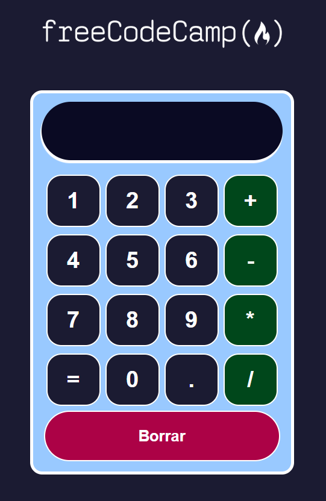

# Aplicación Calculadora

Se creo una calculadora interactiva que va a realizar operaciones básicas, al hacer clic en los botones de + - \* / hará la respectiva operación, también en la parte inferior se encuentra un botón crear el cual reinicia la calculadora para realizar nuevamente las operaciones.

Con este proyecto se logró aprender cómo funcionan los operadores lógicos, operador ternario, función flecha, pasar funciones como props.children y el método addEventListener, también como instalar una librería externa en la terminal y como se agrega automáticamente en el package.json.

## Ejecutar el proyecto

1. Ya que el proyecto contien dependencias para su funcionamiento, lo primero sería instalar las biblitecas requeridas con el siguiente comando `npm install`
2. En el archivo `package.json` se encuentran los scripts para la ejecución del proyecto. Usaremos el script `npm start`
3. La aplicación se ejecutará en la dirección [http://localhost:3000](http://localhost:3000)
4. En el navegador de su preferencia vaya a la ruta indicada y podrá ver la aplicación

## Tareas por hacer

1. Actualizar el proyecto para que use Vite (create-react-app ya está descontinuado)
2. Actualizar el proyecto para que use Tipescript
3. Actualizar el proyecto para que use Tailwind Css
